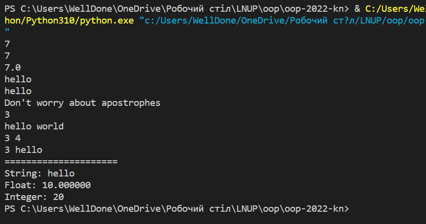
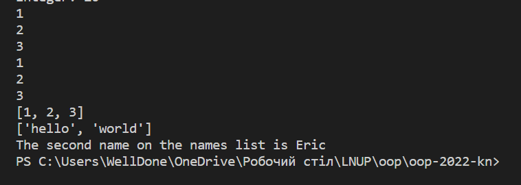
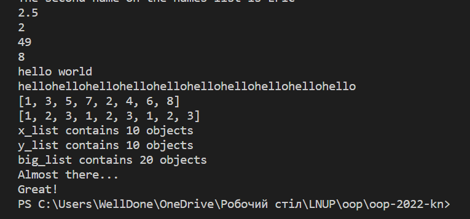
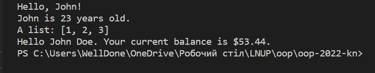
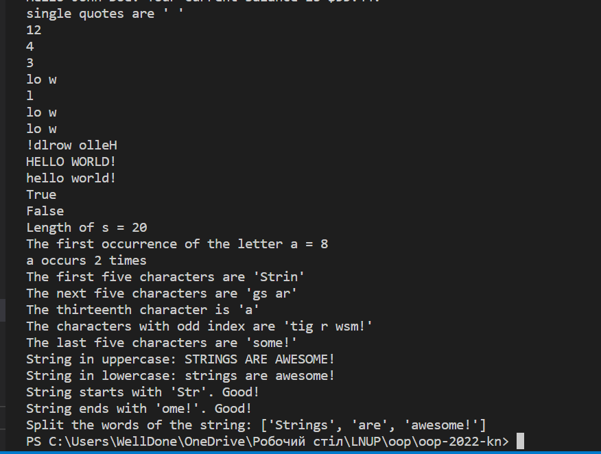
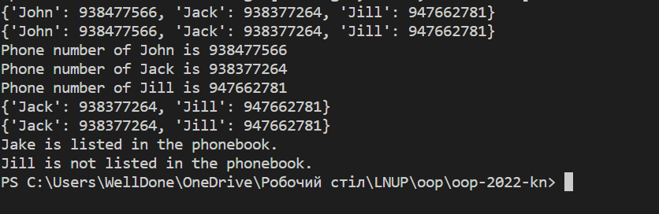

Львівський національний університет природокористування

Факультет механіки, енергетики та інформаційних технологій

Кафедра інформаційних технологій

Звіт з лабораторної роботи №2 на тему:

# Вивчення простих типів даних і методів роботи з ними у Python 3

Виконав: ст. групи КН-12сп 
Батрон Олег

Перевірив: Татомир А. В.

Мета роботи: вивчення основ розробки додатків на Python 3.

## Завдання
1. Вивчити основи синтаксису текстів програм в Python 3.
2. Розглянути поняття змінних в Python 3 та засвоїти їх прості типи.
3. Розглянути поняття динамічної типізації.
4. Навчитися здійснювати базові операції та приведення типів. Розв’язати
приклад згідно виданого завдання.
5. Ознайомитися з типом “List”. Навчитися задавати та зчитувати значення
їх елементів. Розв’язати приклад.
6. Ознайомитися основними операторами мови Python 3. Розв’язати
завдання.
7. Навчитися основам форматування стрічок і текстового виводу.
8. Освоїти роботу зі стрічками як зі списками (“Lists”).
9. Ознайомитися з типом даних “словник” (“Dictionary”). Розв’язати
завдання.

## Хід роботи
1. Використовуючи ресурс https://www.learnpython.org вивчив синтаксис текстів програм Python 3 та отримав завдання для тренування.
2. Розглянув поняття змінних та засвоїв їх основні типи:
   * Змінна - це об'єкт програми, що має тип, ім'я, значення та адресу в пам'яті.
   * Існують наступні основні типи даних: Integer(Ціле число), Float(Число з плаваючою крапкою), String(Текст), bool(0 або 1, Істина або хиба).
3. Вивчив поняття динамічної типізації. Зрозумів що це прийом в програмуванні, в якому змінній присвоюється тип після задання значення. 
4. Навчився розв'язувати базові задачі з змінними.
Код:
```python
myint = 7
print(myint)

myfloat = 7
print(myfloat)
myfloat = float(7)
print(myfloat)

mystring = 'hello'
print(mystring)
mystring = "hello"
print(mystring)

mystring = "Don't worry about apostrophes"
print(mystring)

one = 1
two = 2
three = one + two
print(three)

hello = "hello"
world = "world"
helloworld = hello + " " + world
print(helloworld)

a, b = 3, 4
print(a, b)

# This will work!
one = 1
two = 2
hello = "hello"

print(one + two , hello)

print("=====================")

# change this code
mystring = "hello"
myfloat = 10.0
myint = 20

# testing code
if mystring == "hello":
    print("String: %s" % mystring)
if isinstance(myfloat, float) and myfloat == 10.0:
    print("Float: %f" % myfloat)
if isinstance(myint, int) and myint == 20:
    print("Integer: %d" % myint)
```
Результат:


5. Ознайомився з типом List, задавав та зчитував елементи списку.
Код:
```python
mylist = []
mylist.append(1)
mylist.append(2)
mylist.append(3)
print(mylist[0]) # prints 1
print(mylist[1]) # prints 2
print(mylist[2]) # prints 3

# prints out 1,2,3
for x in mylist:
    print(x)

numbers = []
strings = []
names = ["John", "Eric", "Jessica"]

# write your code here
numbers.append(1)
numbers.append(2)
numbers.append(3)

strings.append("hello")
strings.append("world")

second_name = names[1]

# this code should write out the filled arrays and the second name in the names list (Eric).
print(numbers)
print(strings)
print("The second name on the names list is %s" % second_name)
    
```
Результат:


6. Ознайомився основними операторами мови Python.
Код:
```python
number = 1 + 2 * 3 / 4.0
print(number)

remainder = 11 % 3
print(remainder)

squared = 7 ** 2
cubed = 2 ** 3
print(squared)
print(cubed)

helloworld = "hello" + " " + "world"
print(helloworld)

lotsofhellos = "hello" * 10
print(lotsofhellos)

even_numbers = [2,4,6,8]
odd_numbers = [1,3,5,7]
all_numbers = odd_numbers + even_numbers
print(all_numbers)

print([1,2,3] * 3)

x = object()
y = object()

# TODO: change this code
x_list = [x] * 10
y_list = [y] * 10
big_list = x_list + y_list

print("x_list contains %d objects" % len(x_list))
print("y_list contains %d objects" % len(y_list))
print("big_list contains %d objects" % len(big_list))

# testing code
if x_list.count(x) == 10 and y_list.count(y) == 10:
    print("Almost there...")
if big_list.count(x) == 10 and big_list.count(y) == 10:
    print("Great!")
```
Результат:


7. Ознайомився з основами форматування стрічок і текстового виводу:

```python
# This prints out "Hello, John!"
name = "John"
print("Hello, %s!" % name)

# This prints out "John is 23 years old."
name = "John"
age = 23
print("%s is %d years old." % (name, age))

# This prints out: A list: [1, 2, 3]
mylist = [1,2,3]
print("A list: %s" % mylist)

data = ("John", "Doe", 53.44)
format_string = "Hello %s %s. Your current balance is $%s."

print(format_string % data)
```
Результат:


8. Освоїв роботу зі стрічками як із списками:
Код:
```python
astring = "Hello world!"
print("single quotes are ' '")

print(len(astring))

astring = "Hello world!"
print(astring.index("o"))

astring = "Hello world!"
print(astring.count("l"))

astring = "Hello world!"
print(astring[3:7])

astring = "Hello world!"
print(astring[3:7:2])

astring = "Hello world!"
print(astring[3:7])
print(astring[3:7:1])

astring = "Hello world!"
print(astring[::-1])

astring = "Hello world!"
print(astring.upper())
print(astring.lower())

astring = "Hello world!"
print(astring.startswith("Hello"))
print(astring.endswith("asdfasdfasdf"))

astring = "Hello world!"
afewwords = astring.split(" ")

s = "Strings are awesome!"
# Length should be 20
print("Length of s = %d" % len(s))

# First occurrence of "a" should be at index 8
print("The first occurrence of the letter a = %d" % s.index("a"))

# Number of a's should be 2
print("a occurs %d times" % s.count("a"))

# Slicing the string into bits
print("The first five characters are '%s'" % s[:5]) # Start to 5
print("The next five characters are '%s'" % s[5:10]) # 5 to 10
print("The thirteenth character is '%s'" % s[12]) # Just number 12
print("The characters with odd index are '%s'" %s[1::2]) #(0-based indexing)
print("The last five characters are '%s'" % s[-5:]) # 5th-from-last to end

# Convert everything to uppercase
print("String in uppercase: %s" % s.upper())

# Convert everything to lowercase
print("String in lowercase: %s" % s.lower())

# Check how a string starts
if s.startswith("Str"):
    print("String starts with 'Str'. Good!")

# Check how a string ends
if s.endswith("ome!"):
    print("String ends with 'ome!'. Good!")

# Split the string into three separate strings,
# each containing only a word
print("Split the words of the string: %s" % s.split(" "))
```
Результати:


9. Ознайомився з типом даних Dictionary та розв'язав задачі:
Код:
```python
phonebook = {}
phonebook["John"] = 938477566
phonebook["Jack"] = 938377264
phonebook["Jill"] = 947662781
print(phonebook)

phonebook = {
    "John" : 938477566,
    "Jack" : 938377264,
    "Jill" : 947662781
}
print(phonebook)    

phonebook = {"John" : 938477566,"Jack" : 938377264,"Jill" : 947662781}
for name, number in phonebook.items():
    print("Phone number of %s is %d" % (name, number))

phonebook = {
   "John" : 938477566,
   "Jack" : 938377264,
   "Jill" : 947662781
}
del phonebook["John"]
print(phonebook)

phonebook = {
   "John" : 938477566,
   "Jack" : 938377264,
   "Jill" : 947662781
}
phonebook.pop("John")
print(phonebook)

phonebook = {  
    "John" : 938477566,
    "Jack" : 938377264,
    "Jill" : 947662781
}  

# your code goes here
phonebook["Jake"] = 938273443  
del phonebook["Jill"]  

# testing code
if "Jake" in phonebook:  
    print("Jake is listed in the phonebook.")
    
if "Jill" not in phonebook:      
    print("Jill is not listed in the phonebook.")  
```
Результат:

## Висновки:
1. Виконуюючи дану роботу я навчився синтакситу текстів програм Python 3. 
2. Розглянув та вивчив поняття змінних та їх основні типи. 
3. Зрозумів поняття ***динамічної типізації***. 
4. Навчився користуватись списками **List**. 
5. Вивчив основні оператори мови Python та розв'язав задачі за допомогою них. 
6. Навчився працювати зі стрічками(ввід, вивід, форматування).
7. Навчився працювати зі стрічками як зі списками. 
8. Навчився викоривстовувати словники *Dictionary**. 
