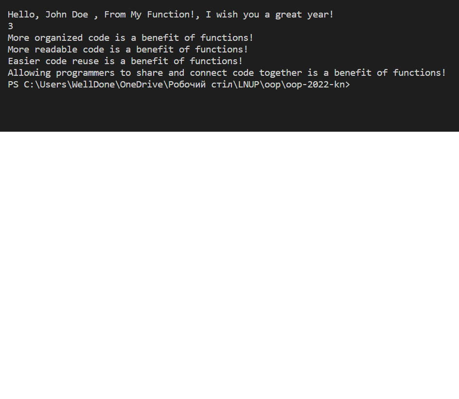

Львівський національний університет природокористування

Факультет механіки, енергетики та інформаційних технологій

Кафедра інформаційних технологій

Звіт з лабораторної роботи №4 на тему:

# Основи процедурного програмування в Python 3

Виконав: ст. групи КН-12сп, Батрон Олег

Перевірив: Татомир А. В.

Мета роботи: Мета роботи полягає у засвоєнні студентами методів та прийомів роботи з функціями.

## Завдання
1. Освоїти синтаксис функцій в Python 3.
2. Закріпити поняття параметрів та аргументів функції.
3. Вивчити методи роботи з функціями, викликати функції, передавати їх в якості параметрів у інші функції (“callback”).
4. Розв’язати заданий приклад.

## Хід роботи
1. Створив файл `lab4.py`.
2. Створив звичайну функцію `function`, яка повертає "Hello From My Function!".
3. Написав функції з аргументами `function_with_args` i `sum_two_numbers`.
4. Виконав завдання з [learnpython](learnpython.org), видозмінивши їх, 
зробивши приклад використання колбеків ("callback") та виклику функцій в інших функціях.

Результати:

## Висновки:
Освоїв синтаксис функцій в Python 3. Засвоїв методи та прийоми роботи з функціями. Навчився використовувати параметри та аргументи функцій. Вивчив значення колбеків та прикладу їх використання. 
