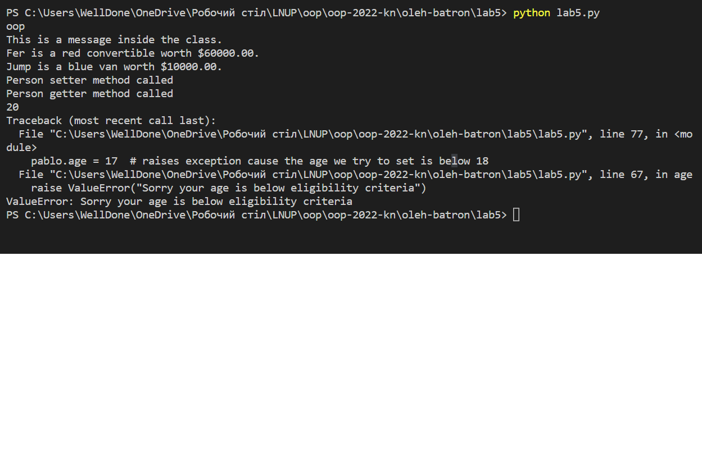

Львівський національний університет природокористування

Факультет механіки, енергетики та інформаційних технологій

Кафедра інформаційних технологій

Звіт з лабораторної роботи №5 на тему:

# Створення та використання класів.

Виконав: ст. групи КН-12сп, Батрон Олег

Перевірив: Татомир А. В.

Мета роботи: ознайомитися з поняттями класів та об’єктів та закріпити на практиці методи їх створення та використання.

## Завдання
1. Навчитися оголошувати класи в Python 3.
2. Навчитися створювати об’єкти (“class instances”).
3. Ознайомитися з поняттям змінної (властивості) класу. Навчитися їх задавати та отримувати їхні значення.
4. Ознайомитися з поняттям функцій об’єкту. Навчитися їх оголошувати та викликати.
5. Розв’язати приклад згідно виданого завдання.

## Хід роботи
1. Оголосив клас `MyClass`, додав йому змінну `variable` та створив функцію для цього класу під назвою `function`.
2. Створив об'єкт класу, якому задав значення змінної `variable`, отримав її значення та викликав метод класу.
3. Виконав завдання згідно [learnpython](learnpython.org) створивши клас `Vehicle` та змінивши його властивості для окремих об'єктів.
4. Навів свій приклад класу `Person` з `getter'ом`, `setter'ом` та методом `__init__`.
5. Так як в попереднії кроках створив об'єкт, передавши аргумет `name`, задав значення змінної класу, але вже за допомогою setter'а
та отримав значення змінної за допомогою getter'а. Потім створив ще один об'єкт `Person`, але задав таке значення `age`, яке райзить помилку.

Результати:

## Висновки:
Ознайомився з поняттями класів та об'єктів та закріпив на практиці методи їх створення та використання. Навчився створювати, задавати та отримувати змінні класів. Закріпив їх наведеним прикладом з `getter'ом` та `setter'ом`. Освоїв функції класів, методи їх створення та виклику. Також опрацював метод-конструктор класів `__init__`.
