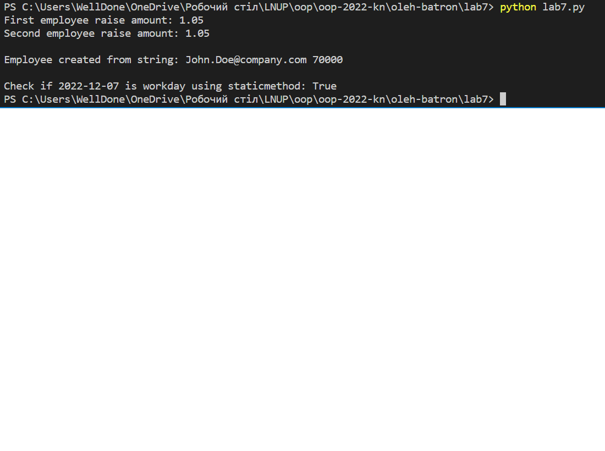

Львівський національний університет природокористування

Факультет механіки, енергетики та інформаційних технологій

Кафедра інформаційних технологій

Звіт з лабораторної роботи №7 на тему:

# Методи класів та статичні методи.

Виконав: ст. групи КН-12сп, Батрон Олег

Перевірив: Татомир А. В.

Мета роботи: ознайомитися з поняттями classmethod та staticmethod.

## Завдання
1. Ознайомитися з поняттям classmethod та staticmethod.

## Хід роботи
1. Скопіював клас `Employee` з минулої роботи.
2. Додав мутоди класу: `set_raise_amount` для задання атрибуту `raise_amount` та `from_string` для створення працівників зі строки.
3. Також створив staticmethod `is_workday`, який повертає True або False в залежності від того чи передана дата являється робочим днем.
4. Створив працівників та задав `raise_amount` за допомогою методу класу `set_raise_amount`.
5. Також створив працівника зі строки та вивів його email та зарплату.
6. Вивів чи являється дата 2022-12-7 робочим днем.

Результати:

## Висновки:
Ознайомився з поняттями classmethod та staticmethod. Навчився їх використувати в класах на власному прикладі. Визначив різницю між цими методами.
